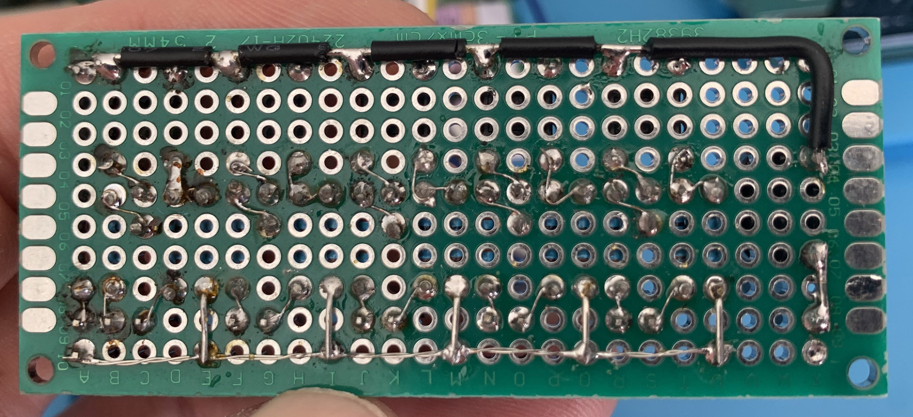

# simon-arduino
*Simon game with some electronics components and Arduino*

# Intro

This is a simple project implementing [Simon game](https://en.wikipedia.org/wiki/Simon_(game)) on Arduino with a user interface based on a prototyping printed circuit board (PCB).

# User interface

## Wiring

We use 5 LEDs/buttons for user's inputs. White LED/button is used to start/stop the game. The other LEDs show the sequence to the user and are lighted when user press the corresponding button. The LEDs states changes are done with Arduino ouputs and the buttons states is read through digitals inputs. So understand that the buttons controls the LEDs through the program. An analog output send a PWM signal to the passive buzzer. A note is associated with each LED color.

Digitals inputs are wired with a 10kΩ pull-down resistor.

## Components

LEDS :
- 1 x Green
- 1 x Red
- 1 x Yellow
- 1 x Blue
- 1 x White

Resistors :
- 5 x 330Ω
- 5 x 100Ω
- 5 x 10kΩ

Others :
- 1 x passive buzzer
- 5 x push switche
- 13 x male pin header

## PCB

Top :

Bottom :

and Arduino/PCB wiring :

# Program

To catch user inputs we need interrupts, but the physical interrupts are limited on Arduino. For my Uno board there is only 2 physicals interrupts available, on PIN 2 and 3.

Softwares interrupts can enhanced Arduino capacity. In this project we use [PinChangeInterrupt library](https://www.arduino.cc/reference/en/libraries/pinchangeinterrupt/).
